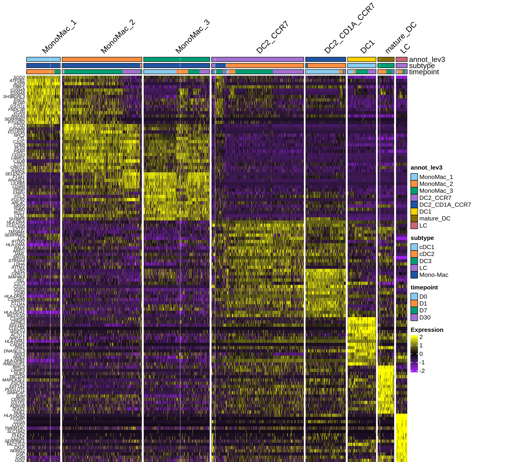
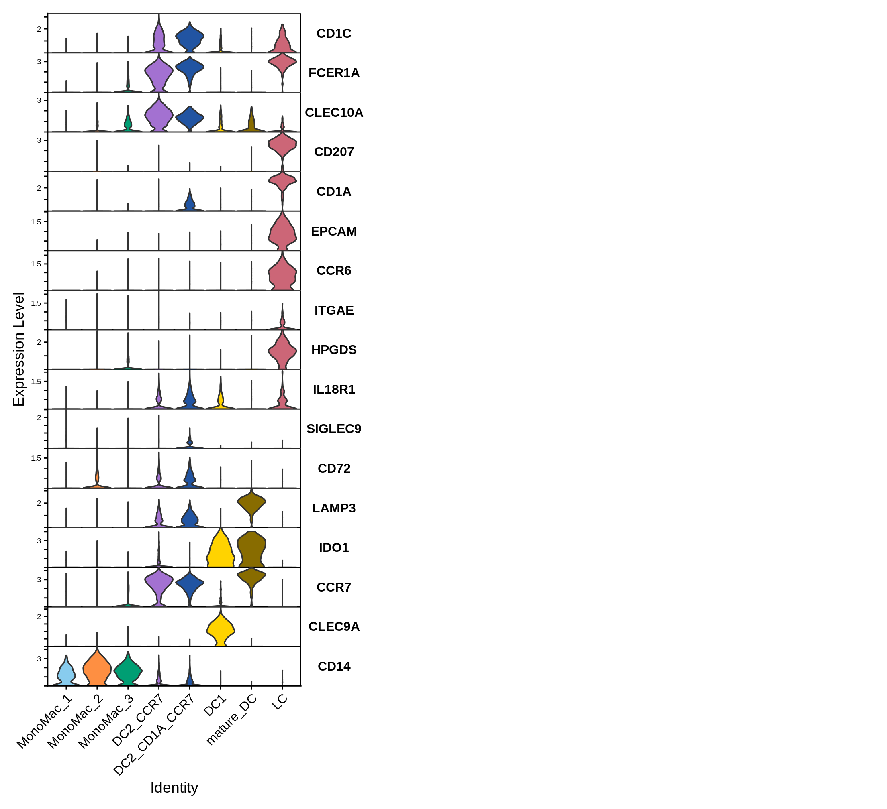
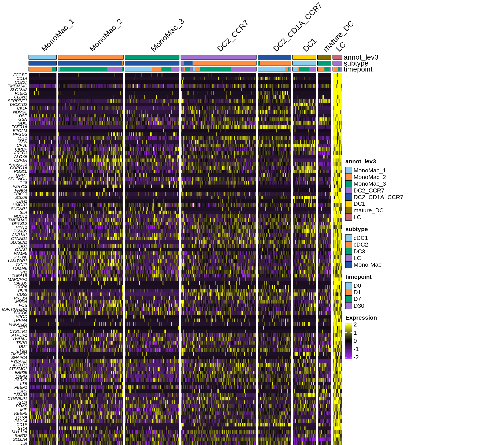
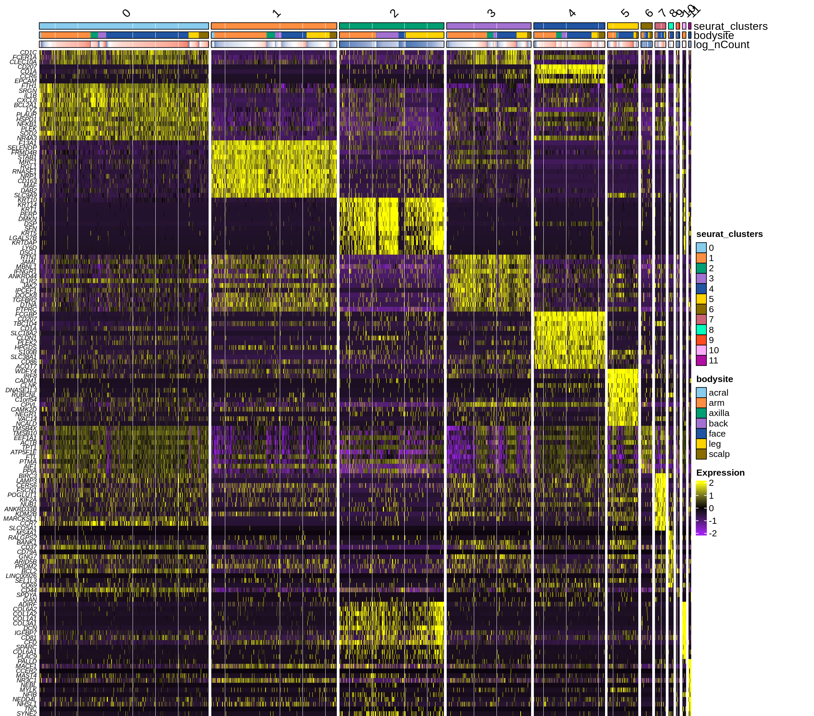
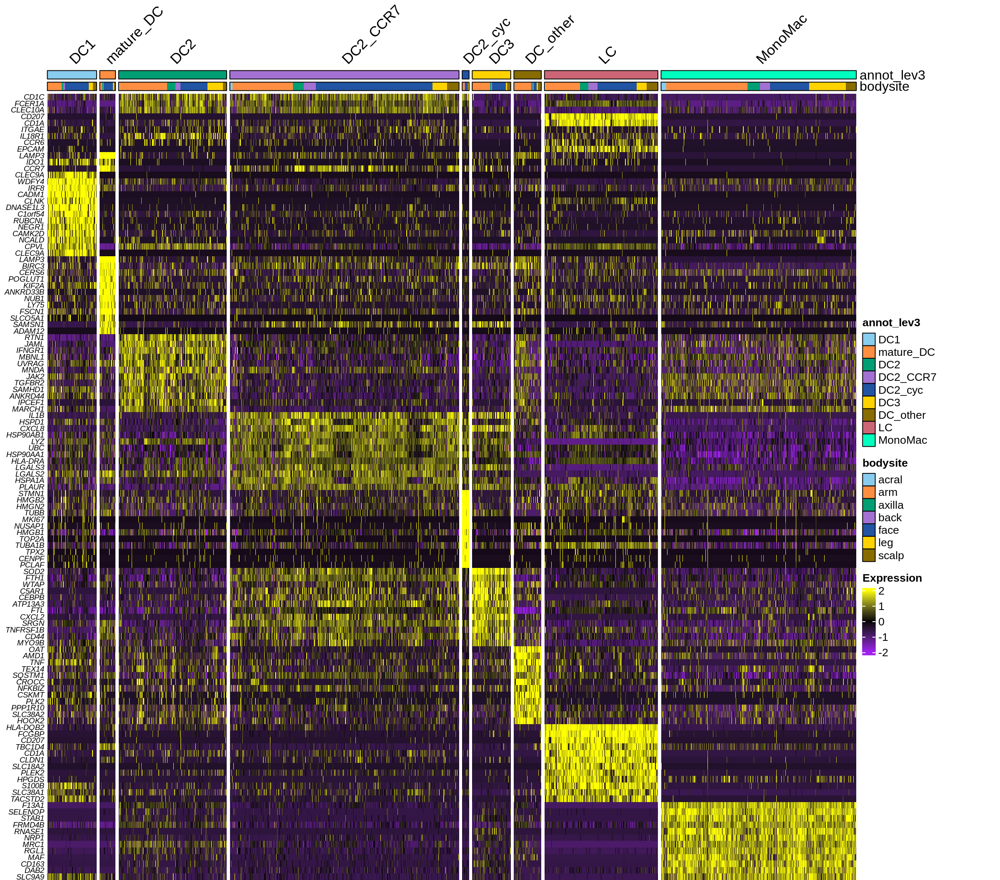

<style type="text/css">
/* Section headers */
h1 { font-size: 1.6em; }
h2 { font-size: 1.3em; }
h3 { font-size: 1.1em; }

/* Document title, author, date */
.title  { font-size: 2em; font-weight: bold; text-align: center; }
.author { font-size: 1.2em; font-style: italic; text-align: center; }
.date   { font-size: 1em; color: #555; text-align: center; }
</style>

``` r
library(knitr)
opts_chunk$set(fig.align = "center",
               fig.retina = 2,
               fig.width = 10,
               #cache = TRUE,
               #cache.lazy = F,
               #autodep=T,
               warning = T,
               message = T,
               eval=F,
               fig.path = "figures/",   # Dossier où stocker les images
               fig.keep = "all"
               # results = 'hide',
               # max.print = 10,
               # out.lines = 10
               )
# Load libraries
library(Seurat)
library(ggplot2)
library(dplyr)
library(magrittr)
library(parallel)
library(tidyverse)
library(qs)
library(presto)
library(simspec)
library(nichenetr)
```

    ## Warning: replacing previous import 'e1071::element' by 'ggplot2::element' when
    ## loading 'nichenetr'

``` r
library(patchwork)
library(nichenetr,quietly = T)
# Load utility scripts
config <- yaml::read_yaml("/pasteur/helix/projects/Dcai/Abdenour/analysis/utils/config.yaml")
source(paste0(config$path_to_scripts, "plot_heatmap2.R"))
source(paste0(config$path_to_scripts, "utils.R"))
source(paste0(config$path_to_scripts, "genes_related.R"))
# Force Seurat to use v3 assays 
options(Seurat.object.assay.version = 'v3') # https://github.com/satijalab/seurat/issues/8164
# Use custom colors in ggplot2
options(ggplot2.discrete.colour=pal)
options(ggplot2.discrete.fill=pal)
# scales::show_col(pal)
```

# 1. Wound Healing Dataset

``` r
# ---- PARAMETERS ----
# Path where all 10X subfolders are located
data_dir <- "../../../../../data_global/public/single_cellRNA/Skin/GSE241132_human skin wound healing/GSE241132_RAW/"  # <- change this

# Get all subfolders (each one should contain matrix.mtx.gz, barcodes.tsv.gz, features.tsv.gz)
folders <- list.dirs(data_dir, full.names = TRUE, recursive = FALSE)

# ---- LOAD ALL DATASETS ----
seurat_list <- list()

for (folder in folders) {
  sample_name <- basename(folder)  # use folder name as sample ID
  cat("Loading:", sample_name, "\n")
  
  counts <- Read10X(data.dir = folder)
  seurat_obj <- CreateSeuratObject(counts = counts, project = sample_name)
  
  # Store sample ID in metadata
  seurat_obj$sample <- sample_name
  
  seurat_list[[sample_name]] <- seurat_obj
}

# ---- MERGE INTO ONE OBJECT ----
# Take the first as reference, then merge all others
for (i in names(seurat_list)) {
  seurat_list[[i]] <- RenameCells(seurat_list[[i]],
                                         add.cell.id = i)
}
merged <- seurat_list[[1]]
if (length(seurat_list) > 1) {
  for (i in 2:length(seurat_list)) {
    merged <- merge(merged, y = seurat_list[[i]])
  }
}

# extract the D + number part
merged$timepoint =  sub(".*(D[0-9]+)$", "\\1", merged$orig.ident)
merged$timepoint = factor(merged$timepoint, levels=c("D0","D1","D7","D30"))
merged$patient_ID =  sub("(PWH[0-9]+).*$", "\\1", merged$orig.ident) 
merged$barcode = colnames(merged)
merged = PercentageFeatureSet(merged, pattern = "^MT-", col.name = "percent.mt")
# ---- SAVE RESULT ----
VlnPlot(merged, "nFeature_RNA")+ scale_y_log10()
# cat("✅ Done! Saved merged Seurat object as merged_seurat.rds\n")
```

``` r
merged = qs::qread("../objects/human_skin_wound_healing_GSE241132.qs")
```

## 1.1. Subsetting myloid cells

``` r
# 65521  cells
merged %<>% subset(subset= nFeature_RNA>500) %<>% subset(percent.mt <20) 
# 62134 cells
# plot(density(merged$percent.mt)) 
# plot(density(metadata$nCount_RNA))
# table(merged$nFeature_RNA<501) 
metadata <- read.delim("../../../../../data_global/public/single_cellRNA/Skin/GSE241132_human skin wound healing/GSE241132_cell_metadata.txt")
merged$cell_type = metadata$newMainCellTypes[match(merged$barcode, metadata$barcode)]
merged$subtype = metadata$newCellTypes[match(merged$barcode, metadata$barcode)]
DimPlot(merged, group.by = "subtype")
# seu_sub = subset(merged, cell_type=="Myeloid", invert=F)
# qsave(seu_sub, "human_skin_wound_healing_GSE241132_Myeloid_filtered.qs", nthreads = 8)
```

Read the already filtered object

``` r
seu_sub = qs::qread("human_skin_wound_healing_GSE241132_Myeloid_filtered.qs", nthreads = 8)
```

Let’s exclude some gene lists from the clustering / visualization as
they may hide relevant biological signals.

``` r
all_genes <- rownames(seu_sub)
HB_genes <- c("HBB","HBA1","HBA2", "HBD","HBE1","HBG1","HBM","HBBP1","HBQ1","AHSP")
metallothionein=c('MT1HL1','MT2A','MT1E','MT1M','MT1A','MT1B','MT1F','MT1G','MT1H','MT1X')
rpgenes= grep("^RP[LS0-9]", all_genes, value=T) # 
other=c("MALAT1","XIST","JCHAIN")
hsp_genes=grep("^HSP", all_genes, value=T) 
dnaj_genes=grep("^DNAJ", all_genes, value=T)
stress_genes= c("JUN","FOS","FOSB","JUNB","ATF3","ATF4",dnaj_genes,hsp_genes)
mtgenes=grep("^MT-", all_genes, value=T) 
MTRN_genes=grep("^MTRN", all_genes, value=T)
IGgenes = grep("^IG[KLH]", all_genes, value=T)
HLAgenes = grep("^HLA-", all_genes, value=T)
s.genes <- cc.genes$s.genes
g2m.genes <- cc.genes$g2m.genes
cell_cycle_genes = c(s.genes,g2m.genes)
genes_mask_clust = c(cell_cycle_genes,HB_genes, metallothionein, rpgenes,other,IGgenes,HLAgenes,MTRN_genes,mtgenes) #stress_genes
genes_mask_plot = c(HB_genes, metallothionein, rpgenes,other,IGgenes,MTRN_genes,mtgenes)#stress_genes
```

## 1.2. DimReduction

``` r
DefaultAssay(seu_sub) = "RNA"
seu_sub = NormalizeData(seu_sub)
seu_sub <- CellCycleScoring(seu_sub, s.features = s.genes, g2m.features = g2m.genes, set.ident = TRUE)
seu_sub = FindVariableFeatures(seu_sub)
vargenes = setdiff(VariableFeatures(seu_sub), genes_mask_clust)
seu_sub <- ScaleData(seu_sub, assay = "RNA", features = vargenes, vars.to.regress =  c("S.Score", "G2M.Score"))
seu_sub <- RunPCA(seu_sub,verbose = FALSE, npcs = 50, reduction.name = "pca", features = vargenes)
nPC= 15
ElbowPlot(seu_sub, ndims = 50, reduction = "pca")+geom_vline(xintercept=nPC,  color="red")
seu_sub <- RunUMAP(seu_sub, reduction = "pca",min.dist = 0.5,spread = 1,  dims = 1:nPC, reduction.name = "umap")
```

## 1.3. Clustering

``` r
DimPlot(seu_sub)

# 36600 features across 65521
seu_sub <- FindNeighbors(seu_sub, reduction = "pca", dims = 1:nPC)
seu_sub <- FindClusters(seu_sub, resolution = 0.2)
# Cluster 6 are DC, subset object to cluster 6 and recluster
DimPlot(seu_sub)
 
cells= Cells(seu_sub)
FeaturePlot(seu_sub, features=c("FCER1A","CD1C","C5AR1","FOLR2","CD207","SPP1","SELENOP","TREM2"), cells = cells, ncol=4, reduction= "umap") & NoAxes()&coord_equal()
markers = presto::wilcoxauc(seu_sub)
markers_dist = markers %>% filter(!feature %in% genes_mask_clust) %>% arrange(desc(avgExpr)) %>% distinct(feature,.keep_all = TRUE) %>%  group_by(group) %>% arrange(desc(auc)) %>% slice_head(n = 30)
```

## 1.4. Annotation and reordering of clusters

``` r
VlnPlot(seu_sub, features =c("CD1C","FCER1A","CLEC10A","CD207","CD1A","EPCAM","CCR6","VCAN","FCN1","C5AR1","IDO1","CCR7","CLEC9A","CD14"), fill="ident",stack=T, flip=T, group.by = "annot_lev3")+NoLegend()+plot_layout(ncol=3)
p <- SCpubr::do_CorrelationPlot(sample = seu_sub,
                                group.by = "RNA_snn_res.0.2",
                                legend.position = "right")
# levels(p$data$x)
seu_sub$seurat_clusters = factor(seu_sub$RNA_snn_res.0.2, levels= c("4","1","2","0","3","5","6","7"))  # levels(p$data$x)

seu_sub$res.0.2 = plyr::mapvalues(seu_sub$seurat_clusters, from = levels(seu_sub$seurat_clusters), to =c(1:8))
seu_sub$annot_lev3 = plyr::mapvalues(seu_sub$res.0.2, from = c(1:8), to =c("MonoMac_1","MonoMac_2","MonoMac_3","DC2_CCR7","DC2_CD1A_CCR7","DC1","mature_DC","LC"))
seu_sub@active.ident = seu_sub$annot_lev3
```

## 1.4. Visualization

Heatmaps

``` r
seu_sub$seurat_clusters = seu_sub@active.ident
markers = presto::wilcoxauc(seu_sub, group_by="seurat_clusters")
```

    ## Warning: The `slot` argument of `GetAssayData()` is deprecated as of SeuratObject 5.0.0.
    ## ℹ Please use the `layer` argument instead.
    ## ℹ The deprecated feature was likely used in the presto package.
    ##   Please report the issue to the authors.
    ## This warning is displayed once every 8 hours.
    ## Call `lifecycle::last_lifecycle_warnings()` to see where this warning was
    ## generated.

``` r
top_markers= presto_topn_auc(markers,object= seu_sub@active.ident,min_pct_in=10, genes_filter=genes_mask_plot, top_n = 15,minavgExpr=0.1)

seu_sub <- ScaleData(seu_sub,features=c(top_markers$feature))
```

    ## Warning: The `slot` argument of `SetAssayData()` is deprecated as of SeuratObject 5.0.0.
    ## ℹ Please use the `layer` argument instead.
    ## ℹ The deprecated feature was likely used in the Seurat package.
    ##   Please report the issue at <https://github.com/satijalab/seurat/issues>.
    ## This warning is displayed once every 8 hours.
    ## Call `lifecycle::last_lifecycle_warnings()` to see where this warning was
    ## generated.

    ## Centering and scaling data matrix

``` r
plot_heatmap2(seu_sub, markers =unique(c(top_markers$feature)),sort_var = c("seurat_clusters","subtype","timepoint"),
              anno_var = c("seurat_clusters","subtype","timepoint"),
              anno_colors = list(pal,pal,pal),
              hm_colors = c("purple","black","yellow"),
              hm_limit = c(-2,0,2),legend2show = c(T,T,T,T,T,F),padding = unit(c(0, 0, 0,2), "cm"),
              row_font_size = 7)
```



``` r
VlnPlot(seu_sub, features =c("CD1C","FCER1A","CLEC10A","CD207","CD1A","EPCAM","CCR6","ITGAE","HPGDS","IL18R1","SIGLEC9","CD72","LAMP3","IDO1","CCR7","CLEC9A","CD14"), fill="ident",stack=T, flip=T)+NoLegend()+plot_layout(ncol=3)
```

    ## Warning: The `slot` argument of `FetchData()` is deprecated as of SeuratObject 5.0.0.
    ## ℹ Please use the `layer` argument instead.
    ## ℹ The deprecated feature was likely used in the Seurat package.
    ##   Please report the issue at <https://github.com/satijalab/seurat/issues>.
    ## This warning is displayed once every 8 hours.
    ## Call `lifecycle::last_lifecycle_warnings()` to see where this warning was
    ## generated.

    ## Warning: `aes_string()` was deprecated in ggplot2 3.0.0.
    ## ℹ Please use tidy evaluation idioms with `aes()`.
    ## ℹ See also `vignette("ggplot2-in-packages")` for more information.
    ## ℹ The deprecated feature was likely used in the Seurat package.
    ##   Please report the issue at <https://github.com/satijalab/seurat/issues>.
    ## This warning is displayed once every 8 hours.
    ## Call `lifecycle::last_lifecycle_warnings()` to see where this warning was
    ## generated.

    ## Warning: Groups with fewer than two datapoints have been dropped.
    ## ℹ Set `drop = FALSE` to consider such groups for position adjustment purposes.
    ## Groups with fewer than two datapoints have been dropped.
    ## ℹ Set `drop = FALSE` to consider such groups for position adjustment purposes.
    ## Groups with fewer than two datapoints have been dropped.
    ## ℹ Set `drop = FALSE` to consider such groups for position adjustment purposes.
    ## Groups with fewer than two datapoints have been dropped.
    ## ℹ Set `drop = FALSE` to consider such groups for position adjustment purposes.
    ## Groups with fewer than two datapoints have been dropped.
    ## ℹ Set `drop = FALSE` to consider such groups for position adjustment purposes.
    ## Groups with fewer than two datapoints have been dropped.
    ## ℹ Set `drop = FALSE` to consider such groups for position adjustment purposes.
    ## Groups with fewer than two datapoints have been dropped.
    ## ℹ Set `drop = FALSE` to consider such groups for position adjustment purposes.
    ## Groups with fewer than two datapoints have been dropped.
    ## ℹ Set `drop = FALSE` to consider such groups for position adjustment purposes.
    ## Groups with fewer than two datapoints have been dropped.
    ## ℹ Set `drop = FALSE` to consider such groups for position adjustment purposes.
    ## Groups with fewer than two datapoints have been dropped.
    ## ℹ Set `drop = FALSE` to consider such groups for position adjustment purposes.
    ## Groups with fewer than two datapoints have been dropped.
    ## ℹ Set `drop = FALSE` to consider such groups for position adjustment purposes.
    ## Groups with fewer than two datapoints have been dropped.
    ## ℹ Set `drop = FALSE` to consider such groups for position adjustment purposes.
    ## Groups with fewer than two datapoints have been dropped.
    ## ℹ Set `drop = FALSE` to consider such groups for position adjustment purposes.
    ## Groups with fewer than two datapoints have been dropped.
    ## ℹ Set `drop = FALSE` to consider such groups for position adjustment purposes.
    ## Groups with fewer than two datapoints have been dropped.
    ## ℹ Set `drop = FALSE` to consider such groups for position adjustment purposes.
    ## Groups with fewer than two datapoints have been dropped.
    ## ℹ Set `drop = FALSE` to consider such groups for position adjustment purposes.
    ## Groups with fewer than two datapoints have been dropped.
    ## ℹ Set `drop = FALSE` to consider such groups for position adjustment purposes.
    ## Groups with fewer than two datapoints have been dropped.
    ## ℹ Set `drop = FALSE` to consider such groups for position adjustment purposes.
    ## Groups with fewer than two datapoints have been dropped.
    ## ℹ Set `drop = FALSE` to consider such groups for position adjustment purposes.
    ## Groups with fewer than two datapoints have been dropped.
    ## ℹ Set `drop = FALSE` to consider such groups for position adjustment purposes.
    ## Groups with fewer than two datapoints have been dropped.
    ## ℹ Set `drop = FALSE` to consider such groups for position adjustment purposes.
    ## Groups with fewer than two datapoints have been dropped.
    ## ℹ Set `drop = FALSE` to consider such groups for position adjustment purposes.
    ## Groups with fewer than two datapoints have been dropped.
    ## ℹ Set `drop = FALSE` to consider such groups for position adjustment purposes.
    ## Groups with fewer than two datapoints have been dropped.
    ## ℹ Set `drop = FALSE` to consider such groups for position adjustment purposes.
    ## Groups with fewer than two datapoints have been dropped.
    ## ℹ Set `drop = FALSE` to consider such groups for position adjustment purposes.
    ## Groups with fewer than two datapoints have been dropped.
    ## ℹ Set `drop = FALSE` to consider such groups for position adjustment purposes.
    ## Groups with fewer than two datapoints have been dropped.
    ## ℹ Set `drop = FALSE` to consider such groups for position adjustment purposes.
    ## Groups with fewer than two datapoints have been dropped.
    ## ℹ Set `drop = FALSE` to consider such groups for position adjustment purposes.
    ## Groups with fewer than two datapoints have been dropped.
    ## ℹ Set `drop = FALSE` to consider such groups for position adjustment purposes.
    ## Groups with fewer than two datapoints have been dropped.
    ## ℹ Set `drop = FALSE` to consider such groups for position adjustment purposes.
    ## Groups with fewer than two datapoints have been dropped.
    ## ℹ Set `drop = FALSE` to consider such groups for position adjustment purposes.
    ## Groups with fewer than two datapoints have been dropped.
    ## ℹ Set `drop = FALSE` to consider such groups for position adjustment purposes.
    ## Groups with fewer than two datapoints have been dropped.
    ## ℹ Set `drop = FALSE` to consider such groups for position adjustment purposes.
    ## Groups with fewer than two datapoints have been dropped.
    ## ℹ Set `drop = FALSE` to consider such groups for position adjustment purposes.
    ## Groups with fewer than two datapoints have been dropped.
    ## ℹ Set `drop = FALSE` to consider such groups for position adjustment purposes.
    ## Groups with fewer than two datapoints have been dropped.
    ## ℹ Set `drop = FALSE` to consider such groups for position adjustment purposes.
    ## Groups with fewer than two datapoints have been dropped.
    ## ℹ Set `drop = FALSE` to consider such groups for position adjustment purposes.
    ## Groups with fewer than two datapoints have been dropped.
    ## ℹ Set `drop = FALSE` to consider such groups for position adjustment purposes.
    ## Groups with fewer than two datapoints have been dropped.
    ## ℹ Set `drop = FALSE` to consider such groups for position adjustment purposes.
    ## Groups with fewer than two datapoints have been dropped.
    ## ℹ Set `drop = FALSE` to consider such groups for position adjustment purposes.
    ## Groups with fewer than two datapoints have been dropped.
    ## ℹ Set `drop = FALSE` to consider such groups for position adjustment purposes.
    ## Groups with fewer than two datapoints have been dropped.
    ## ℹ Set `drop = FALSE` to consider such groups for position adjustment purposes.
    ## Groups with fewer than two datapoints have been dropped.
    ## ℹ Set `drop = FALSE` to consider such groups for position adjustment purposes.
    ## Groups with fewer than two datapoints have been dropped.
    ## ℹ Set `drop = FALSE` to consider such groups for position adjustment purposes.
    ## Groups with fewer than two datapoints have been dropped.
    ## ℹ Set `drop = FALSE` to consider such groups for position adjustment purposes.
    ## Groups with fewer than two datapoints have been dropped.
    ## ℹ Set `drop = FALSE` to consider such groups for position adjustment purposes.
    ## Groups with fewer than two datapoints have been dropped.
    ## ℹ Set `drop = FALSE` to consider such groups for position adjustment purposes.
    ## Groups with fewer than two datapoints have been dropped.
    ## ℹ Set `drop = FALSE` to consider such groups for position adjustment purposes.
    ## Groups with fewer than two datapoints have been dropped.
    ## ℹ Set `drop = FALSE` to consider such groups for position adjustment purposes.
    ## Groups with fewer than two datapoints have been dropped.
    ## ℹ Set `drop = FALSE` to consider such groups for position adjustment purposes.
    ## Groups with fewer than two datapoints have been dropped.
    ## ℹ Set `drop = FALSE` to consider such groups for position adjustment purposes.



``` r
top_markers= presto_topn_auc(markers,object= seu_sub@active.ident,min_pct_in=10, max_pct_out = 100, genes_filter=genes_mask_clust, top_n = 100,minavgExpr=0.1)

seu_sub <- ScaleData(seu_sub,features=c(top_markers$feature))
```

    ## Centering and scaling data matrix

``` r
plot_heatmap2(seu_sub,  markers = unique(c(top_markers$feature[top_markers$group=="7"])),sort_var = c("seurat_clusters","subtype","timepoint"),
              anno_var = c("seurat_clusters","subtype","timepoint"),
              anno_colors = list(pal,pal,pal),
              hm_colors = c("purple","black","yellow"),
              hm_limit = c(-2,0,2),legend2show = c(T,T,T,T,T,F),padding = unit(c(0, 0, 0, 5), "cm"),
              row_font_size = 7)
```



``` r
markers = presto::wilcoxauc(seu_sub) 

markers$feature = UpdateSymbolsHuman(markers$feature)
```

    ## Maps last updated on: Sat Nov 16 10:35:32 2024

    ## Warning in HGNChelper::checkGeneSymbols(vec): Human gene symbols should be all
    ## upper-case except for the 'orf' in open reading frames. The case of some
    ## letters was corrected.

    ## Warning in HGNChelper::checkGeneSymbols(vec): x contains non-approved gene
    ## symbols

``` r
top_markers = markers %>% filter(!feature %in% genes_mask_plot & avgExpr>0.1 & logFC>0.1  & pct_in>10) %>% group_by(group) %>% arrange(desc(auc),.by_group =T )

top_markers_distinct = markers %>% filter(!feature %in% genes_mask_plot &  avgExpr>0.1 & pct_in>10 & logFC>0.1)  %>% arrange(desc(avgExpr)) %>% distinct(feature,.keep_all = TRUE) %>% group_by(group) %>% arrange(desc(auc), .by_group =T)

# WriteXLS::WriteXLS(top_markers_distinct, "results/skin_wound_healing_myeloid_clusters_markers_distinct.xlsx")
# WriteXLS::WriteXLS(top_markers, "results/skin_wound_healing_myeloid_clusters_markers.xlsx")
```

## 1.5. Saving Data

``` r
# qsave(seu_sub, "human_skin_wound_healing_GSE241132_Myeloid_filtered_processed.qs", nthreads = 8)
seu_sub = qs::qread("human_skin_wound_healing_GSE241132_Myeloid_filtered_processed.qs", nthreads = 8)
```

\################################################################################
\################################################################################
\################################################################################

# 2. Multi-site Skin Atlas

Multi site Skin Atlas (biorXiv)

``` r
# atlas_skin_seu = readRDS("../../../../../data_global/public/single_cellRNA/Skin/Atlas_multi_skin/seurat_v3.RDS")
atlas_skin_seu@assays$RNA$scale.data = NULL
# qsave(atlas_skin_seu, "../../../../../data_global/public/single_cellRNA/Skin/Atlas_multi_skin/seurat_v3.qs", nthreads = 8)
atlas_skin_seu = qread("../../../../../data_global/public/single_cellRNA/Skin/Atlas_multi_skin/seurat_v3.qs", nthreads = 8)
```

## 2.1 Subsetting myeloid cells

``` r
atlas_skin_seu= NormalizeData(atlas_skin_seu)
DimPlot(atlas_skin_seu)
str(atlas_skin_seu)
atlas_skin_myelo = subset(atlas_skin_seu, celltype=="Myeloid Cells") 
# qsave(atlas_skin_myelo, "../../../../../data_global/public/single_cellRNA/Skin/Atlas_multi_skin/seurat_v3_myelo.qs", nthreads = 8)
```

``` r
# atlas_skin_myelo_tmp = qread("../../../../../data_global/public/single_cellRNA/Skin/Atlas_multi_skin/seurat_v3_myelo.qs", nthreads = 8)
# str(atlas_skin_myelo_tmp)

# same object but already clustered
atlas_skin_myelo_tmp = qread("../../../../../data_global/public/single_cellRNA/Skin/Atlas_multi_skin/seurat_v3_myelo_processed_intermediate.qs", nthreads = 8)
str(atlas_skin_myelo_tmp)
```

    ## Formal class 'Seurat' [package "SeuratObject"] with 13 slots
    ##   ..@ assays      :List of 1
    ##   .. ..$ RNA:Formal class 'Assay' [package "SeuratObject"] with 8 slots
    ##   .. .. .. ..@ counts       :Formal class 'dgCMatrix' [package "Matrix"] with 6 slots
    ##   .. .. .. .. .. ..@ i       : int [1:27018231] 20 24 42 47 53 62 67 80 83 91 ...
    ##   .. .. .. .. .. ..@ p       : int [1:11362] 0 3174 5309 9469 13793 17007 19376 23098 26120 29003 ...
    ##   .. .. .. .. .. ..@ Dim     : int [1:2] 34621 11361
    ##   .. .. .. .. .. ..@ Dimnames:List of 2
    ##   .. .. .. .. .. .. ..$ : chr [1:34621] "MIR1302-2HG" "AL627309.1" "AL627309.3" "AL627309.5" ...
    ##   .. .. .. .. .. .. ..$ : chr [1:11361] "ACTTAGGCACTTTATC-1" "AGCTTCCCATAGACTC-1" "ATTACCTAGGTAAAGG-1" "CAAGACTGTCTTGCTC-1" ...
    ##   .. .. .. .. .. ..@ x       : num [1:27018231] 0.989 0.971 0.987 0.98 1.969 ...
    ##   .. .. .. .. .. ..@ factors : list()
    ##   .. .. .. ..@ data         :Formal class 'dgCMatrix' [package "Matrix"] with 6 slots
    ##   .. .. .. .. .. ..@ i       : int [1:27018231] 20 24 42 47 53 62 67 80 83 91 ...
    ##   .. .. .. .. .. ..@ p       : int [1:11362] 0 3174 5309 9469 13793 17007 19376 23098 26120 29003 ...
    ##   .. .. .. .. .. ..@ Dim     : int [1:2] 34621 11361
    ##   .. .. .. .. .. ..@ Dimnames:List of 2
    ##   .. .. .. .. .. .. ..$ : chr [1:34621] "MIR1302-2HG" "AL627309.1" "AL627309.3" "AL627309.5" ...
    ##   .. .. .. .. .. .. ..$ : chr [1:11361] "ACTTAGGCACTTTATC-1" "AGCTTCCCATAGACTC-1" "ATTACCTAGGTAAAGG-1" "CAAGACTGTCTTGCTC-1" ...
    ##   .. .. .. .. .. ..@ x       : num [1:27018231] 0.51 0.502 0.508 0.506 0.843 ...
    ##   .. .. .. .. .. ..@ factors : list()
    ##   .. .. .. ..@ scale.data   : num [1:138, 1:11361] 1.158 -0.681 -0.364 -0.479 0.334 ...
    ##   .. .. .. .. ..- attr(*, "dimnames")=List of 2
    ##   .. .. .. .. .. ..$ : chr [1:138] "ACOT7" "PRDM2" "SFN" "MARCKSL1" ...
    ##   .. .. .. .. .. ..$ : chr [1:11361] "ACTTAGGCACTTTATC-1" "AGCTTCCCATAGACTC-1" "ATTACCTAGGTAAAGG-1" "CAAGACTGTCTTGCTC-1" ...
    ##   .. .. .. ..@ assay.orig   : NULL
    ##   .. .. .. ..@ var.features : chr [1:1934] "CCL17" "CXCL9" "PTGDS" "CCL18" ...
    ##   .. .. .. ..@ meta.features:'data.frame':   34621 obs. of  5 variables:
    ##   .. .. .. .. ..$ vst.mean                 : num [1:34621] 0 0.00641 0 0.01157 0 ...
    ##   .. .. .. .. ..$ vst.variance             : num [1:34621] 0 0.00969 0 0.0128 0 ...
    ##   .. .. .. .. ..$ vst.variance.expected    : num [1:34621] 0 0.00851 0 0.01622 0 ...
    ##   .. .. .. .. ..$ vst.variance.standardized: num [1:34621] 0 1.139 0 0.789 0 ...
    ##   .. .. .. .. ..$ vst.variable             : logi [1:34621] FALSE FALSE FALSE FALSE FALSE FALSE ...
    ##   .. .. .. ..@ misc         : list()
    ##   .. .. .. ..@ key          : chr "rna_"
    ##   ..@ meta.data   :'data.frame': 11361 obs. of  25 variables:
    ##   .. ..$ orig.ident             : Factor w/ 95 levels "1630-YJ-2","200819_AR010_NORMAL_face",..: 1 1 1 1 1 1 1 1 1 1 ...
    ##   .. ..$ nCount_RNA             : num [1:11361] 14887 7943 15775 18766 10445 ...
    ##   .. ..$ nFeature_RNA           : int [1:11361] 3173 2128 4157 4322 3207 2363 3720 3018 2880 4615 ...
    ##   .. ..$ orig.nb                : num [1:11361] 1 1 1 1 1 1 1 1 1 1 ...
    ##   .. ..$ batch                  : Factor w/ 51 levels "11","30","31",..: 1 1 1 1 1 1 1 1 1 1 ...
    ##   .. ..$ Tissue                 : Factor w/ 3 levels "skin","dermis",..: 1 1 1 1 1 1 1 1 1 1 ...
    ##   .. ..$ Body_site              : Factor w/ 10 levels "arm","face","back",..: 1 1 1 1 1 1 1 1 1 1 ...
    ##   .. ..$ calls                  : chr [1:11361, 1] "singlet" "singlet" "singlet" "singlet" ...
    ##   .. .. ..- attr(*, "dimnames")=List of 2
    ##   .. .. .. ..$ : chr [1:11361] "ACTTAGGCACTTTATC-1" "AGCTTCCCATAGACTC-1" "ATTACCTAGGTAAAGG-1" "CAAGACTGTCTTGCTC-1" ...
    ##   .. .. .. ..$ : NULL
    ##   .. ..$ percent.mt             : num [1:11361] 0.316 0.334 0.614 0.632 0.471 ...
    ##   .. ..$ QC                     : chr [1:11361] "TRUE" "TRUE" "TRUE" "TRUE" ...
    ##   .. ..$ RNA_snn_res.0.5        : Factor w/ 3 levels "9","47","53": 3 3 3 3 3 3 3 3 1 3 ...
    ##   .. ..$ seurat_clusters        : Factor w/ 12 levels "0","1","2","3",..: 5 5 5 5 5 5 5 5 5 5 ...
    ##   .. ..$ seurat_clusters_harmony: Factor w/ 9 levels "3","4","9","10",..: 4 4 4 4 4 4 4 4 4 4 ...
    ##   .. ..$ age                    : int [1:11361] 50 50 50 50 50 50 50 50 50 50 ...
    ##   .. ..$ sex                    : chr [1:11361] "F" "F" "F" "F" ...
    ##   .. ..$ race                   : chr [1:11361] "white" "white" "white" "white" ...
    ##   .. ..$ bodysite               : chr [1:11361] "arm" "arm" "arm" "arm" ...
    ##   .. ..$ celltype               : chr [1:11361] "Myeloid Cells" "Myeloid Cells" "Myeloid Cells" "Myeloid Cells" ...
    ##   .. ..$ S.Score                : num [1:11361] 0.0517 0.0141 0.0559 0.0557 0.0764 ...
    ##   .. ..$ G2M.Score              : num [1:11361] 0.03314 0.0201 0.06181 0.00386 -0.00366 ...
    ##   .. ..$ Phase                  : chr [1:11361] "S" "G2M" "G2M" "S" ...
    ##   .. ..$ old.ident              : Factor w/ 1 level "Myeloid Cells": 1 1 1 1 1 1 1 1 1 1 ...
    ##   .. ..$ RNA_snn_res.0.3        : Factor w/ 13 levels "0","1","2","3",..: 5 5 5 5 5 5 5 5 5 5 ...
    ##   .. ..$ RNA_snn_res.0.2        : Factor w/ 12 levels "0","1","2","3",..: 5 5 5 5 5 5 5 5 5 5 ...
    ##   .. ..$ log_nCount             : num [1:11361] 4.17 3.9 4.2 4.27 4.02 ...
    ##   ..@ active.assay: chr "RNA"
    ##   ..@ active.ident: Factor w/ 12 levels "0","1","2","3",..: 5 5 5 5 5 5 5 5 5 5 ...
    ##   .. ..- attr(*, "names")= chr [1:11361] "ACTTAGGCACTTTATC-1" "AGCTTCCCATAGACTC-1" "ATTACCTAGGTAAAGG-1" "CAAGACTGTCTTGCTC-1" ...
    ##   ..@ graphs      :List of 2
    ##   .. ..$ RNA_nn :Formal class 'Graph' [package "SeuratObject"] with 7 slots
    ##   .. .. .. ..@ assay.used: chr "RNA"
    ##   .. .. .. ..@ i         : int [1:227220] 0 5 33 71 104 129 135 149 165 167 ...
    ##   .. .. .. ..@ p         : int [1:11362] 0 26 39 64 84 117 155 170 179 202 ...
    ##   .. .. .. ..@ Dim       : int [1:2] 11361 11361
    ##   .. .. .. ..@ Dimnames  :List of 2
    ##   .. .. .. .. ..$ : chr [1:11361] "ACTTAGGCACTTTATC-1" "AGCTTCCCATAGACTC-1" "ATTACCTAGGTAAAGG-1" "CAAGACTGTCTTGCTC-1" ...
    ##   .. .. .. .. ..$ : chr [1:11361] "ACTTAGGCACTTTATC-1" "AGCTTCCCATAGACTC-1" "ATTACCTAGGTAAAGG-1" "CAAGACTGTCTTGCTC-1" ...
    ##   .. .. .. ..@ x         : num [1:227220] 1 1 1 1 1 1 1 1 1 1 ...
    ##   .. .. .. ..@ factors   : list()
    ##   .. ..$ RNA_snn:Formal class 'Graph' [package "SeuratObject"] with 7 slots
    ##   .. .. .. ..@ assay.used: chr "RNA"
    ##   .. .. .. ..@ i         : int [1:802487] 0 1 5 7 8 16 27 33 36 44 ...
    ##   .. .. .. ..@ p         : int [1:11362] 0 65 134 204 277 349 427 496 571 648 ...
    ##   .. .. .. ..@ Dim       : int [1:2] 11361 11361
    ##   .. .. .. ..@ Dimnames  :List of 2
    ##   .. .. .. .. ..$ : chr [1:11361] "ACTTAGGCACTTTATC-1" "AGCTTCCCATAGACTC-1" "ATTACCTAGGTAAAGG-1" "CAAGACTGTCTTGCTC-1" ...
    ##   .. .. .. .. ..$ : chr [1:11361] "ACTTAGGCACTTTATC-1" "AGCTTCCCATAGACTC-1" "ATTACCTAGGTAAAGG-1" "CAAGACTGTCTTGCTC-1" ...
    ##   .. .. .. ..@ x         : num [1:802487] 1 0.111 0.538 0.25 0.333 ...
    ##   .. .. .. ..@ factors   : list()
    ##   ..@ neighbors   : list()
    ##   ..@ reductions  :List of 3
    ##   .. ..$ pca    :Formal class 'DimReduc' [package "SeuratObject"] with 9 slots
    ##   .. .. .. ..@ cell.embeddings           : num [1:11361, 1:50] -2.995 -0.541 -6.542 -7.115 -4.11 ...
    ##   .. .. .. .. ..- attr(*, "dimnames")=List of 2
    ##   .. .. .. .. .. ..$ : chr [1:11361] "ACTTAGGCACTTTATC-1" "AGCTTCCCATAGACTC-1" "ATTACCTAGGTAAAGG-1" "CAAGACTGTCTTGCTC-1" ...
    ##   .. .. .. .. .. ..$ : chr [1:50] "PC_1" "PC_2" "PC_3" "PC_4" ...
    ##   .. .. .. ..@ feature.loadings          : num [1:1934, 1:50] -0.01672 -0.01128 0.02571 0.03299 -0.00745 ...
    ##   .. .. .. .. ..- attr(*, "dimnames")=List of 2
    ##   .. .. .. .. .. ..$ : chr [1:1934] "CCL17" "CXCL9" "PTGDS" "CCL18" ...
    ##   .. .. .. .. .. ..$ : chr [1:50] "PC_1" "PC_2" "PC_3" "PC_4" ...
    ##   .. .. .. ..@ feature.loadings.projected: num[0 , 0 ] 
    ##   .. .. .. ..@ assay.used                : chr "RNA"
    ##   .. .. .. ..@ global                    : logi FALSE
    ##   .. .. .. ..@ stdev                     : num [1:50] 7.75 6.43 5.48 4.92 4.08 ...
    ##   .. .. .. ..@ jackstraw                 :Formal class 'JackStrawData' [package "SeuratObject"] with 4 slots
    ##   .. .. .. .. .. ..@ empirical.p.values     : num[0 , 0 ] 
    ##   .. .. .. .. .. ..@ fake.reduction.scores  : num[0 , 0 ] 
    ##   .. .. .. .. .. ..@ empirical.p.values.full: num[0 , 0 ] 
    ##   .. .. .. .. .. ..@ overall.p.values       : num[0 , 0 ] 
    ##   .. .. .. ..@ misc                      :List of 1
    ##   .. .. .. .. ..$ total.variance: num 1506
    ##   .. .. .. ..@ key                       : chr "PC_"
    ##   .. ..$ umap   :Formal class 'DimReduc' [package "SeuratObject"] with 9 slots
    ##   .. .. .. ..@ cell.embeddings           : num [1:11361, 1:2] 5.71 6.22 6.88 6.71 7.13 ...
    ##   .. .. .. .. ..- attr(*, "scaled:center")= num [1:2] 0.347 0.34
    ##   .. .. .. .. ..- attr(*, "dimnames")=List of 2
    ##   .. .. .. .. .. ..$ : chr [1:11361] "ACTTAGGCACTTTATC-1" "AGCTTCCCATAGACTC-1" "ATTACCTAGGTAAAGG-1" "CAAGACTGTCTTGCTC-1" ...
    ##   .. .. .. .. .. ..$ : chr [1:2] "umap_1" "umap_2"
    ##   .. .. .. ..@ feature.loadings          : num[0 , 0 ] 
    ##   .. .. .. ..@ feature.loadings.projected: num[0 , 0 ] 
    ##   .. .. .. ..@ assay.used                : chr "RNA"
    ##   .. .. .. ..@ global                    : logi TRUE
    ##   .. .. .. ..@ stdev                     : num(0) 
    ##   .. .. .. ..@ jackstraw                 :Formal class 'JackStrawData' [package "SeuratObject"] with 4 slots
    ##   .. .. .. .. .. ..@ empirical.p.values     : num[0 , 0 ] 
    ##   .. .. .. .. .. ..@ fake.reduction.scores  : num[0 , 0 ] 
    ##   .. .. .. .. .. ..@ empirical.p.values.full: num[0 , 0 ] 
    ##   .. .. .. .. .. ..@ overall.p.values       : num[0 , 0 ] 
    ##   .. .. .. ..@ misc                      : list()
    ##   .. .. .. ..@ key                       : chr "umap_"
    ##   .. ..$ harmony:Formal class 'DimReduc' [package "SeuratObject"] with 9 slots
    ##   .. .. .. ..@ cell.embeddings           : num [1:11361, 1:50] 2.16 1.53 2 1.88 1.61 ...
    ##   .. .. .. .. ..- attr(*, "dimnames")=List of 2
    ##   .. .. .. .. .. ..$ : chr [1:11361] "ACTTAGGCACTTTATC-1" "AGCTTCCCATAGACTC-1" "ATTACCTAGGTAAAGG-1" "CAAGACTGTCTTGCTC-1" ...
    ##   .. .. .. .. .. ..$ : chr [1:50] "harmony_1" "harmony_2" "harmony_3" "harmony_4" ...
    ##   .. .. .. ..@ feature.loadings          : num [1:34621, 1:50] 3089 2805.5 -85.2 -13540.8 135.9 ...
    ##   .. .. .. .. ..- attr(*, "dimnames")=List of 2
    ##   .. .. .. .. .. ..$ : chr [1:34621] "MIR1302-2HG" "AL627309.1" "AL627309.3" "AL627309.5" ...
    ##   .. .. .. .. .. ..$ : chr [1:50] "harmony_1" "harmony_2" "harmony_3" "harmony_4" ...
    ##   .. .. .. ..@ feature.loadings.projected: num [1:34621, 1:50] 3089 2805.5 -85.2 -13540.8 135.9 ...
    ##   .. .. .. .. ..- attr(*, "dimnames")=List of 2
    ##   .. .. .. .. .. ..$ : chr [1:34621] "MIR1302-2HG" "AL627309.1" "AL627309.3" "AL627309.5" ...
    ##   .. .. .. .. .. ..$ : chr [1:50] "harmony_1" "harmony_2" "harmony_3" "harmony_4" ...
    ##   .. .. .. ..@ assay.used                : chr "RNA"
    ##   .. .. .. ..@ global                    : logi FALSE
    ##   .. .. .. ..@ stdev                     : num [1:50] 8.83 7.45 6.62 5.99 5.23 ...
    ##   .. .. .. ..@ jackstraw                 :Formal class 'JackStrawData' [package "SeuratObject"] with 4 slots
    ##   .. .. .. .. .. ..@ empirical.p.values     : num[0 , 0 ] 
    ##   .. .. .. .. .. ..@ fake.reduction.scores  : num[0 , 0 ] 
    ##   .. .. .. .. .. ..@ empirical.p.values.full: num[0 , 0 ] 
    ##   .. .. .. .. .. ..@ overall.p.values       : num[0 , 0 ] 
    ##   .. .. .. ..@ misc                      : list()
    ##   .. .. .. ..@ key                       : chr "harmony_"
    ##   ..@ images      : list()
    ##   ..@ project.name: chr "scRNA_pipeline"
    ##   ..@ misc        : list()
    ##   ..@ version     :Classes 'package_version', 'numeric_version'  hidden list of 1
    ##   .. ..$ : int [1:3] 4 0 4
    ##   ..@ commands    :List of 11
    ##   .. ..$ Seurat..ProjectDim.RNA.harmony:Formal class 'SeuratCommand' [package "SeuratObject"] with 5 slots
    ##   .. .. .. ..@ name       : chr "Seurat::ProjectDim.RNA.harmony"
    ##   .. .. .. ..@ time.stamp : POSIXct[1:1], format: "2023-01-26 06:36:31"
    ##   .. .. .. ..@ assay.used : chr "RNA"
    ##   .. .. .. ..@ call.string: chr [1:2] "Seurat::ProjectDim(object, reduction = reduction.save, overwrite = TRUE, " "    verbose = FALSE)"
    ##   .. .. .. ..@ params     :List of 7
    ##   .. .. .. .. ..$ reduction      : chr "harmony"
    ##   .. .. .. .. ..$ assay          : chr "RNA"
    ##   .. .. .. .. ..$ dims.print     : int [1:5] 1 2 3 4 5
    ##   .. .. .. .. ..$ nfeatures.print: num 20
    ##   .. .. .. .. ..$ overwrite      : logi TRUE
    ##   .. .. .. .. ..$ do.center      : logi FALSE
    ##   .. .. .. .. ..$ verbose        : logi FALSE
    ##   .. ..$ RunUMAP.RNA.harmony           :Formal class 'SeuratCommand' [package "SeuratObject"] with 5 slots
    ##   .. .. .. ..@ name       : chr "RunUMAP.RNA.harmony"
    ##   .. .. .. ..@ time.stamp : POSIXct[1:1], format: "2023-01-26 06:49:42"
    ##   .. .. .. ..@ assay.used : chr "RNA"
    ##   .. .. .. ..@ call.string: chr "RunUMAP(Seurat, dims = 1:pc.dim, reduction = \"harmony\")"
    ##   .. .. .. ..@ params     :List of 26
    ##   .. .. .. .. ..$ dims                : int [1:50] 1 2 3 4 5 6 7 8 9 10 ...
    ##   .. .. .. .. ..$ reduction           : chr "harmony"
    ##   .. .. .. .. ..$ assay               : chr "RNA"
    ##   .. .. .. .. ..$ slot                : chr "data"
    ##   .. .. .. .. ..$ umap.method         : chr "uwot"
    ##   .. .. .. .. ..$ return.model        : logi FALSE
    ##   .. .. .. .. ..$ n.neighbors         : int 30
    ##   .. .. .. .. ..$ n.components        : int 2
    ##   .. .. .. .. ..$ metric              : chr "cosine"
    ##   .. .. .. .. ..$ learning.rate       : num 1
    ##   .. .. .. .. ..$ min.dist            : num 0.3
    ##   .. .. .. .. ..$ spread              : num 1
    ##   .. .. .. .. ..$ set.op.mix.ratio    : num 1
    ##   .. .. .. .. ..$ local.connectivity  : int 1
    ##   .. .. .. .. ..$ repulsion.strength  : num 1
    ##   .. .. .. .. ..$ negative.sample.rate: int 5
    ##   .. .. .. .. ..$ uwot.sgd            : logi FALSE
    ##   .. .. .. .. ..$ seed.use            : int 42
    ##   .. .. .. .. ..$ angular.rp.forest   : logi FALSE
    ##   .. .. .. .. ..$ densmap             : logi FALSE
    ##   .. .. .. .. ..$ dens.lambda         : num 2
    ##   .. .. .. .. ..$ dens.frac           : num 0.3
    ##   .. .. .. .. ..$ dens.var.shift      : num 0.1
    ##   .. .. .. .. ..$ verbose             : logi TRUE
    ##   .. .. .. .. ..$ reduction.name      : chr "umap"
    ##   .. .. .. .. ..$ reduction.key       : chr "UMAP_"
    ##   .. ..$ FindNeighbors.RNA.harmony     :Formal class 'SeuratCommand' [package "SeuratObject"] with 5 slots
    ##   .. .. .. ..@ name       : chr "FindNeighbors.RNA.harmony"
    ##   .. .. .. ..@ time.stamp : POSIXct[1:1], format: "2023-01-26 06:51:47"
    ##   .. .. .. ..@ assay.used : chr "RNA"
    ##   .. .. .. ..@ call.string: chr "FindNeighbors(Seurat, dims = 1:pc.dim, reduction = \"harmony\")"
    ##   .. .. .. ..@ params     :List of 17
    ##   .. .. .. .. ..$ reduction      : chr "harmony"
    ##   .. .. .. .. ..$ dims           : int [1:50] 1 2 3 4 5 6 7 8 9 10 ...
    ##   .. .. .. .. ..$ assay          : chr "RNA"
    ##   .. .. .. .. ..$ k.param        : num 20
    ##   .. .. .. .. ..$ return.neighbor: logi FALSE
    ##   .. .. .. .. ..$ compute.SNN    : logi TRUE
    ##   .. .. .. .. ..$ prune.SNN      : num 0.0667
    ##   .. .. .. .. ..$ nn.method      : chr "annoy"
    ##   .. .. .. .. ..$ n.trees        : num 50
    ##   .. .. .. .. ..$ annoy.metric   : chr "euclidean"
    ##   .. .. .. .. ..$ nn.eps         : num 0
    ##   .. .. .. .. ..$ verbose        : logi TRUE
    ##   .. .. .. .. ..$ force.recalc   : logi FALSE
    ##   .. .. .. .. ..$ do.plot        : logi FALSE
    ##   .. .. .. .. ..$ graph.name     : chr [1:2] "RNA_nn" "RNA_snn"
    ##   .. .. .. .. ..$ l2.norm        : logi FALSE
    ##   .. .. .. .. ..$ cache.index    : logi FALSE
    ##   .. ..$ FindNeighbors.RNA.umap        :Formal class 'SeuratCommand' [package "SeuratObject"] with 5 slots
    ##   .. .. .. ..@ name       : chr "FindNeighbors.RNA.umap"
    ##   .. .. .. ..@ time.stamp : POSIXct[1:1], format: "2023-02-07 15:33:51"
    ##   .. .. .. ..@ assay.used : chr "RNA"
    ##   .. .. .. ..@ call.string: chr "FindNeighbors(seurat, dims = 1:2, reduction = \"umap\")"
    ##   .. .. .. ..@ params     :List of 17
    ##   .. .. .. .. ..$ reduction      : chr "umap"
    ##   .. .. .. .. ..$ dims           : int [1:2] 1 2
    ##   .. .. .. .. ..$ assay          : chr "RNA"
    ##   .. .. .. .. ..$ k.param        : num 20
    ##   .. .. .. .. ..$ return.neighbor: logi FALSE
    ##   .. .. .. .. ..$ compute.SNN    : logi TRUE
    ##   .. .. .. .. ..$ prune.SNN      : num 0.0667
    ##   .. .. .. .. ..$ nn.method      : chr "annoy"
    ##   .. .. .. .. ..$ n.trees        : num 50
    ##   .. .. .. .. ..$ annoy.metric   : chr "euclidean"
    ##   .. .. .. .. ..$ nn.eps         : num 0
    ##   .. .. .. .. ..$ verbose        : logi TRUE
    ##   .. .. .. .. ..$ force.recalc   : logi FALSE
    ##   .. .. .. .. ..$ do.plot        : logi FALSE
    ##   .. .. .. .. ..$ graph.name     : chr [1:2] "RNA_nn" "RNA_snn"
    ##   .. .. .. .. ..$ l2.norm        : logi FALSE
    ##   .. .. .. .. ..$ cache.index    : logi FALSE
    ##   .. ..$ NormalizeData.RNA             :Formal class 'SeuratCommand' [package "SeuratObject"] with 5 slots
    ##   .. .. .. ..@ name       : chr "NormalizeData.RNA"
    ##   .. .. .. ..@ time.stamp : POSIXct[1:1], format: "2025-10-08 15:20:22"
    ##   .. .. .. ..@ assay.used : chr "RNA"
    ##   .. .. .. ..@ call.string: chr "NormalizeData(atlas_skin_myelo_tmp)"
    ##   .. .. .. ..@ params     :List of 5
    ##   .. .. .. .. ..$ assay               : chr "RNA"
    ##   .. .. .. .. ..$ normalization.method: chr "LogNormalize"
    ##   .. .. .. .. ..$ scale.factor        : num 10000
    ##   .. .. .. .. ..$ margin              : num 1
    ##   .. .. .. .. ..$ verbose             : logi TRUE
    ##   .. ..$ FindVariableFeatures.RNA      :Formal class 'SeuratCommand' [package "SeuratObject"] with 5 slots
    ##   .. .. .. ..@ name       : chr "FindVariableFeatures.RNA"
    ##   .. .. .. ..@ time.stamp : POSIXct[1:1], format: "2025-10-08 15:20:25"
    ##   .. .. .. ..@ assay.used : chr "RNA"
    ##   .. .. .. ..@ call.string: chr "FindVariableFeatures(atlas_skin_myelo_tmp, nfeatures = 2000)"
    ##   .. .. .. ..@ params     :List of 12
    ##   .. .. .. .. ..$ assay              : chr "RNA"
    ##   .. .. .. .. ..$ selection.method   : chr "vst"
    ##   .. .. .. .. ..$ loess.span         : num 0.3
    ##   .. .. .. .. ..$ clip.max           : chr "auto"
    ##   .. .. .. .. ..$ mean.function      :function (mat, display_progress)  
    ##   .. .. .. .. ..$ dispersion.function:function (mat, display_progress)  
    ##   .. .. .. .. ..$ num.bin            : num 20
    ##   .. .. .. .. ..$ binning.method     : chr "equal_width"
    ##   .. .. .. .. ..$ nfeatures          : num 2000
    ##   .. .. .. .. ..$ mean.cutoff        : num [1:2] 0.1 8
    ##   .. .. .. .. ..$ dispersion.cutoff  : num [1:2] 1 Inf
    ##   .. .. .. .. ..$ verbose            : logi TRUE
    ##   .. ..$ RunPCA.RNA                    :Formal class 'SeuratCommand' [package "SeuratObject"] with 5 slots
    ##   .. .. .. ..@ name       : chr "RunPCA.RNA"
    ##   .. .. .. ..@ time.stamp : POSIXct[1:1], format: "2025-10-08 15:21:06"
    ##   .. .. .. ..@ assay.used : chr "RNA"
    ##   .. .. .. ..@ call.string: chr [1:2] "RunPCA(atlas_skin_myelo_tmp, verbose = FALSE, npcs = 50, " "    reduction.name = \"pca\", features = vargenes)"
    ##   .. .. .. ..@ params     :List of 11
    ##   .. .. .. .. ..$ assay          : chr "RNA"
    ##   .. .. .. .. ..$ features       : chr [1:1934] "CCL17" "CXCL9" "PTGDS" "CCL18" ...
    ##   .. .. .. .. ..$ npcs           : num 50
    ##   .. .. .. .. ..$ rev.pca        : logi FALSE
    ##   .. .. .. .. ..$ weight.by.var  : logi TRUE
    ##   .. .. .. .. ..$ verbose        : logi FALSE
    ##   .. .. .. .. ..$ ndims.print    : int [1:5] 1 2 3 4 5
    ##   .. .. .. .. ..$ nfeatures.print: num 30
    ##   .. .. .. .. ..$ reduction.name : chr "pca"
    ##   .. .. .. .. ..$ reduction.key  : chr "PC_"
    ##   .. .. .. .. ..$ seed.use       : num 42
    ##   .. ..$ FindNeighbors.RNA.pca         :Formal class 'SeuratCommand' [package "SeuratObject"] with 5 slots
    ##   .. .. .. ..@ name       : chr "FindNeighbors.RNA.pca"
    ##   .. .. .. ..@ time.stamp : POSIXct[1:1], format: "2025-10-08 15:21:46"
    ##   .. .. .. ..@ assay.used : chr "RNA"
    ##   .. .. .. ..@ call.string: chr [1:2] "FindNeighbors(atlas_skin_myelo_tmp, reduction = \"pca\", " "    dims = 1:nPC)"
    ##   .. .. .. ..@ params     :List of 16
    ##   .. .. .. .. ..$ reduction      : chr "pca"
    ##   .. .. .. .. ..$ dims           : int [1:19] 1 2 3 4 5 6 7 8 9 10 ...
    ##   .. .. .. .. ..$ assay          : chr "RNA"
    ##   .. .. .. .. ..$ k.param        : num 20
    ##   .. .. .. .. ..$ return.neighbor: logi FALSE
    ##   .. .. .. .. ..$ compute.SNN    : logi TRUE
    ##   .. .. .. .. ..$ prune.SNN      : num 0.0667
    ##   .. .. .. .. ..$ nn.method      : chr "annoy"
    ##   .. .. .. .. ..$ n.trees        : num 50
    ##   .. .. .. .. ..$ annoy.metric   : chr "euclidean"
    ##   .. .. .. .. ..$ nn.eps         : num 0
    ##   .. .. .. .. ..$ verbose        : logi TRUE
    ##   .. .. .. .. ..$ do.plot        : logi FALSE
    ##   .. .. .. .. ..$ graph.name     : chr [1:2] "RNA_nn" "RNA_snn"
    ##   .. .. .. .. ..$ l2.norm        : logi FALSE
    ##   .. .. .. .. ..$ cache.index    : logi FALSE
    ##   .. ..$ RunUMAP.RNA.pca               :Formal class 'SeuratCommand' [package "SeuratObject"] with 5 slots
    ##   .. .. .. ..@ name       : chr "RunUMAP.RNA.pca"
    ##   .. .. .. ..@ time.stamp : POSIXct[1:1], format: "2025-10-08 15:22:05"
    ##   .. .. .. ..@ assay.used : chr "RNA"
    ##   .. .. .. ..@ call.string: chr [1:2] "RunUMAP(atlas_skin_myelo_tmp, reduction = \"pca\", min.dist = 0.5, " "    spread = 1, dims = 1:nPC, reduction.name = \"umap\")"
    ##   .. .. .. ..@ params     :List of 25
    ##   .. .. .. .. ..$ dims                : int [1:19] 1 2 3 4 5 6 7 8 9 10 ...
    ##   .. .. .. .. ..$ reduction           : chr "pca"
    ##   .. .. .. .. ..$ assay               : chr "RNA"
    ##   .. .. .. .. ..$ slot                : chr "data"
    ##   .. .. .. .. ..$ umap.method         : chr "uwot"
    ##   .. .. .. .. ..$ return.model        : logi FALSE
    ##   .. .. .. .. ..$ n.neighbors         : int 30
    ##   .. .. .. .. ..$ n.components        : int 2
    ##   .. .. .. .. ..$ metric              : chr "cosine"
    ##   .. .. .. .. ..$ learning.rate       : num 1
    ##   .. .. .. .. ..$ min.dist            : num 0.5
    ##   .. .. .. .. ..$ spread              : num 1
    ##   .. .. .. .. ..$ set.op.mix.ratio    : num 1
    ##   .. .. .. .. ..$ local.connectivity  : int 1
    ##   .. .. .. .. ..$ repulsion.strength  : num 1
    ##   .. .. .. .. ..$ negative.sample.rate: int 5
    ##   .. .. .. .. ..$ uwot.sgd            : logi FALSE
    ##   .. .. .. .. ..$ seed.use            : int 42
    ##   .. .. .. .. ..$ angular.rp.forest   : logi FALSE
    ##   .. .. .. .. ..$ densmap             : logi FALSE
    ##   .. .. .. .. ..$ dens.lambda         : num 2
    ##   .. .. .. .. ..$ dens.frac           : num 0.3
    ##   .. .. .. .. ..$ dens.var.shift      : num 0.1
    ##   .. .. .. .. ..$ verbose             : logi TRUE
    ##   .. .. .. .. ..$ reduction.name      : chr "umap"
    ##   .. ..$ FindClusters                  :Formal class 'SeuratCommand' [package "SeuratObject"] with 5 slots
    ##   .. .. .. ..@ name       : chr "FindClusters"
    ##   .. .. .. ..@ time.stamp : POSIXct[1:1], format: "2025-10-08 15:22:07"
    ##   .. .. .. ..@ assay.used : chr "RNA"
    ##   .. .. .. ..@ call.string: chr "FindClusters(atlas_skin_myelo_tmp, resolution = 0.2)"
    ##   .. .. .. ..@ params     :List of 10
    ##   .. .. .. .. ..$ graph.name      : chr "RNA_snn"
    ##   .. .. .. .. ..$ cluster.name    : chr "RNA_snn_res.0.2"
    ##   .. .. .. .. ..$ modularity.fxn  : num 1
    ##   .. .. .. .. ..$ resolution      : num 0.2
    ##   .. .. .. .. ..$ algorithm       : num 1
    ##   .. .. .. .. ..$ n.start         : num 10
    ##   .. .. .. .. ..$ n.iter          : num 10
    ##   .. .. .. .. ..$ random.seed     : num 0
    ##   .. .. .. .. ..$ group.singletons: logi TRUE
    ##   .. .. .. .. ..$ verbose         : logi TRUE
    ##   .. ..$ ScaleData.RNA                 :Formal class 'SeuratCommand' [package "SeuratObject"] with 5 slots
    ##   .. .. .. ..@ name       : chr "ScaleData.RNA"
    ##   .. .. .. ..@ time.stamp : POSIXct[1:1], format: "2025-10-08 15:27:37"
    ##   .. .. .. ..@ assay.used : chr "RNA"
    ##   .. .. .. ..@ call.string: chr [1:2] "ScaleData(atlas_skin_myelo_tmp, features = c(genes2show, " "    top_markers$feature))"
    ##   .. .. .. ..@ params     :List of 10
    ##   .. .. .. .. ..$ features          : chr [1:138] "CD1C" "FCER1A" "CLEC10A" "CD207" ...
    ##   .. .. .. .. ..$ assay             : chr "RNA"
    ##   .. .. .. .. ..$ model.use         : chr "linear"
    ##   .. .. .. .. ..$ use.umi           : logi FALSE
    ##   .. .. .. .. ..$ do.scale          : logi TRUE
    ##   .. .. .. .. ..$ do.center         : logi TRUE
    ##   .. .. .. .. ..$ scale.max         : num 10
    ##   .. .. .. .. ..$ block.size        : num 1000
    ##   .. .. .. .. ..$ min.cells.to.block: num 3000
    ##   .. .. .. .. ..$ verbose           : logi TRUE
    ##   ..@ tools       : list()

``` r
all_genes <- rownames(atlas_skin_myelo_tmp)
HB_genes <- c("HBB","HBA1","HBA2", "HBD","HBE1","HBG1","HBM","HBBP1","HBQ1","AHSP")
metallothionein=c('MT1HL1','MT2A','MT1E','MT1M','MT1A','MT1B','MT1F','MT1G','MT1H','MT1X')
rpgenes= grep("^RP[LS0-9]", all_genes, value=T) # 
other=c("MALAT1","XIST","JCHAIN",grep("^IGLL", all_genes, value=T))
mtgenes=grep("^MT-", all_genes, value=T) 
MTRN_genes=grep("^MTRN", all_genes, value=T)
# stress_genes = c("HSPA1B","HSPA6","DNAJB1","HSPA1A","HSPB1","JUN","UBB","DNAJB4","BAG3","UBC","SOD1","RGS2","EIF4A2","SERPINH1","DEDD2","CLK1","AHSA1","COMMD6","HSP90AA1","HSPH1","HSPE1","HSPD1","HSP90AB1","DUSP1","HSPA8","FOS","DNAJA1","PPP1R15A","CACYBP","KLF6","ZFAND2A","NR4A1","FOSB","DNAJA4","CHORDC1","MRPL18","BTG2","FKBP4","NEU1","ATF3","MYADM","ERN1","DOK2","GADD45B","TXNIP","NABP1","SOD2","TCP1","DNAJB6","RHOB","H3F3B","MXD1","AC020916.1","IER5","JUNB","TNFSF14")
IGgenes = grep("^IG[KLH]", all_genes, value=T)
HLAgenes = grep("^HLA-", all_genes, value=T)
s.genes <- cc.genes$s.genes
g2m.genes <- cc.genes$g2m.genes
cell_cycle_genes = c(s.genes,g2m.genes)
genes_mask_clust = c(cell_cycle_genes,HB_genes, metallothionein, rpgenes,other,IGgenes,HLAgenes,MTRN_genes,mtgenes)
genes_mask_plot = c(HB_genes, metallothionein, rpgenes,other,IGgenes,MTRN_genes,mtgenes)
```

## 2.2. DimReduction

``` r
DefaultAssay(atlas_skin_myelo_tmp) = "RNA"
atlas_skin_myelo_tmp = NormalizeData(atlas_skin_myelo_tmp) 
atlas_skin_myelo_tmp <- CellCycleScoring(atlas_skin_myelo_tmp, s.features = s.genes, g2m.features = g2m.genes, set.ident = TRUE)
atlas_skin_myelo_tmp = FindVariableFeatures(atlas_skin_myelo_tmp, nfeatures = 2000)
vargenes = setdiff(VariableFeatures(atlas_skin_myelo_tmp), genes_mask_clust)
VariableFeatures(atlas_skin_myelo_tmp)= vargenes
atlas_skin_myelo_tmp <- ScaleData(atlas_skin_myelo_tmp, assay = "RNA", features = vargenes, vars.to.regress =  c("S.Score", "G2M.Score"))
atlas_skin_myelo_tmp <- RunPCA(atlas_skin_myelo_tmp,verbose = FALSE, npcs = 50, reduction.name = "pca", features = vargenes)
```

``` r
nPC= 19
ElbowPlot(atlas_skin_myelo_tmp, ndims = 50, reduction = "pca")+geom_vline(xintercept=nPC,  color="red")
```


## 2.3. Clustering

``` r
RunPrestoAllWithAvg
# 33952 features across 24700
atlas_skin_myelo_tmp <- FindNeighbors(atlas_skin_myelo_tmp, reduction = "pca", dims = 1:nPC)
atlas_skin_myelo_tmp <- FindClusters(atlas_skin_myelo_tmp, resolution = 0.3)
atlas_skin_myelo_tmp <- RunUMAP(atlas_skin_myelo_tmp, reduction = "pca",min.dist = 0.5,spread = 1,  dims = 1:nPC, reduction.name = "umap")
DimPlot(atlas_skin_myelo_tmp)
atlas_skin_myelo_tmp <- FindClusters(atlas_skin_myelo_tmp, resolution = 0.2)

cells= Cells(atlas_skin_myelo_tmp)
FeaturePlot(atlas_skin_myelo_tmp, features=c("FCER1A","CD1C","C5AR1","FOLR2","CD207","CLEC9A","XCR1","CLEC10A"), cells = cells, ncol=4, reduction= "umap") & NoAxes()&coord_equal()
markers = presto::wilcoxauc(atlas_skin_myelo_tmp,group.by = "seurat_clusters")

markers_dist = markers %>% filter(!feature %in% genes_mask_clust) %>% arrange(desc(avgExpr)) %>% distinct(feature,.keep_all = TRUE) %>%  group_by(group) %>% arrange(desc(auc)) %>% slice_head(n = 30)

# qsave(atlas_skin_myelo_tmp  , "../../../../../data_global/public/single_cellRNA/Skin/Atlas_multi_skin/seurat_v3_myelo_processed_intermediate.qs", nthreads = 8)
```

``` r
DimPlot(atlas_skin_myelo_tmp, group.by = "seurat_clusters")+plot_spacer()
```



## 2.4. Visualization and removing junk clusters

Heatmaps

``` r
atlas_skin_myelo_tmp@active.ident = factor(atlas_skin_myelo_tmp$seurat_clusters)
genes2show= c("CD1C","FCER1A","CLEC10A","CD207","CD1A","CCR6","EPCAM")
markers = presto::wilcoxauc(atlas_skin_myelo_tmp, group_by="seurat_clusters")
top_markers= presto_topn_auc(markers,object= atlas_skin_myelo_tmp@active.ident,min_pct_in=10, genes_filter=genes_mask_clust, top_n = 12,minavgExpr=0.1)

atlas_skin_myelo_tmp <- ScaleData(atlas_skin_myelo_tmp,features=c(genes2show,top_markers$feature))
atlas_skin_myelo_tmp$log_nCount = log10(atlas_skin_myelo_tmp$nCount_RNA)

plot_heatmap2(atlas_skin_myelo_tmp, markers =c(genes2show,top_markers$feature),sort_var = c("seurat_clusters","bodysite","log_nCount"),
              anno_var = c("seurat_clusters","bodysite","log_nCount"),
              anno_colors = list(pal,pal,dim_pal),
              hm_colors = c("purple","black","yellow"),
              hm_limit = c(-2,0,2),legend2show = c(T,T,F,T,T,F),
              row_font_size = 7)

VlnPlot(atlas_skin_myelo_tmp, "log_nCount")+plot_layout(nrow=3, ncol=2)

# remove clusters: 2 KRT epithelial+ Collagenes, 6, 9 & 11 low quality, 8 B cells, 10 enriched in collagen genes
# atlas_skin_myelo = subset(atlas_skin_myelo_tmp, idents= c(2,6,9,11,8,10), invert=T)
# 34621 features across 8975
```

``` r
# atlas_skin_myelo = subset(atlas_skin_myelo_tmp, idents= c(2,6,9,11,8,10), invert=T)
# this is to read the final object with the most recent clustering
atlas_skin_myelo = qread("../../../../../data_global/public/single_cellRNA/Skin/Atlas_multi_skin/seurat_v3_myelo_reprocessed_final.qs", nthreads = 8)
```

## 2.5. Repeating DimReduction

``` r
atlas_skin_myelo = FindVariableFeatures(atlas_skin_myelo, nfeatures = 2000)
vargenes = setdiff(VariableFeatures(atlas_skin_myelo), genes_mask_clust)
VariableFeatures(atlas_skin_myelo)= vargenes
atlas_skin_myelo <- ScaleData(atlas_skin_myelo, assay = "RNA", features = vargenes, vars.to.regress =  c("S.Score", "G2M.Score"))
atlas_skin_myelo <- RunPCA(atlas_skin_myelo,verbose = FALSE, npcs = 50, reduction.name = "pca", features = vargenes)
```

``` r
nPC= 17
ElbowPlot(atlas_skin_myelo, ndims = 50, reduction = "pca")+geom_vline(xintercept=nPC,  color="red")+plot_layout(nrow=2, ncol=2)
```


## 2.6. Repeating Clustering

``` r
# 33952 features across 24700
atlas_skin_myelo <- FindNeighbors(atlas_skin_myelo, reduction = "pca", dims = 1:nPC)
atlas_skin_myelo <- FindClusters(atlas_skin_myelo, resolution = 0.3)
atlas_skin_myelo <- RunUMAP(atlas_skin_myelo, reduction = "pca",min.dist = 0.5,spread = 1,  dims = 1:nPC, reduction.name = "umap")
```

``` r
DimPlot(atlas_skin_myelo, group.by="seurat_clusters")
```


## 2.6. Annotation and reordering of clusters

``` r
# p <- SCpubr::do_CorrelationPlot(sample = atlas_skin_myelo,
#                                 group.by = "RNA_snn_res.0.3",
#                                 legend.position = "right")
# levels(p$data$x)
atlas_skin_myelo$seurat_clusters = factor(atlas_skin_myelo$RNA_snn_res.0.3, levels= c("4","7","3","0","8","5","6","2","1"))  # levels(p$data$x)

atlas_skin_myelo$res.0.3 = plyr::mapvalues(atlas_skin_myelo$seurat_clusters, from = c("4","7","3","0","8","5","6","2","1"), to =c(1:9))
atlas_skin_myelo$annot_lev3 = plyr::mapvalues(atlas_skin_myelo$res.0.3, from = c(1:9), to =c("DC1","mature_DC","DC2","DC2_CCR7","DC2_cyc","DC3","DC_other","DC2_CD207","MonoMac"))
atlas_skin_myelo@active.ident = atlas_skin_myelo$annot_lev3
```

``` r
DimPlot(atlas_skin_myelo, group.by="annot_lev3")
```



## 2.7 Save final processed object

``` r
qsave(atlas_skin_myelo, "../../../../../data_global/public/single_cellRNA/Skin/Atlas_multi_skin/seurat_v3_myelo_reprocessed_final.qs", nthreads = 8)
```

``` r
DimPlot(atlas_skin_myelo, group.by = c("RNA_snn_res.0.3", "res.0.3", "annot_lev3"), ncol=3, reduction= "umap") & NoAxes()&coord_equal()
```


## 2.8. Visualization

Heatmaps

``` r
atlas_skin_myelo@active.ident = factor(atlas_skin_myelo$annot_lev3)
genes2show= c("CD1C","FCER1A","CLEC10A","CD207","CD1A","ITGAE","IL18R1","CCR6","EPCAM","LAMP3","IDO1","CCR7","CLEC9A")
markers = presto::wilcoxauc(atlas_skin_myelo, group_by="annot_lev3")
top_markers= presto_topn_auc(markers,object= atlas_skin_myelo@active.ident,min_pct_in=10, genes_filter=genes_mask_plot, top_n = 12,minavgExpr=0.1)

atlas_skin_myelo <- ScaleData(atlas_skin_myelo,features=c(genes2show,top_markers$feature))

plot_heatmap2(atlas_skin_myelo, markers =c(genes2show,top_markers$feature),sort_var = c("annot_lev3","bodysite"),
              anno_var = c("annot_lev3","bodysite"),
              anno_colors = list(pal,pal,pal),
              hm_colors = c("purple","black","yellow"),
              hm_limit = c(-2,0,2),legend2show = c(T,T,F,T,T,F),
              row_font_size = 7)

top_markers= presto_topn_auc(markers,object= atlas_skin_myelo@active.ident,min_pct_in=10, genes_filter=genes_mask_plot, top_n = 120,minavgExpr=0.1)

atlas_skin_myelo <- ScaleData(atlas_skin_myelo,features=c(top_markers$feature))

plot_heatmap2(atlas_skin_myelo, markers =c(top_markers$feature[top_markers$group=="DC2_CD207"][1:100]),sort_var = c("annot_lev3","bodysite"),
              anno_var = c("annot_lev3","bodysite"),
              anno_colors = list(pal,pal,pal),
              hm_colors = c("purple","black","yellow"),
              hm_limit = c(-2,0,2),legend2show = c(T,T,F,T,T,F),padding=unit(c(0, 0, 0, 6.5), "cm"), 
              row_font_size = 7)

VlnPlot(atlas_skin_myelo, "log_nCount")+plot_layout(nrow=3, ncol=2)

# # remove clusters: 2 KRT epithelial+ Collagenes, 6, 9 & 11 low quality, 8 B cells, 10 collagenes 
# plot(density(atlas_skin_myelo$log_nCount))
# atlas_skin_myelo = subset(atlas_skin_myelo, idents= c(2,6,9,11,8,10), invert=T)
# # 34621 features across 8975
# 
# atlas_skin_myelo
# VlnPlot(atlas_skin_myelo, features =c("CD1C","FCER1A","CLEC10A","CD207","CD1A","EPCAM","CCR6","ITGAE","HPGDS","IL18R1","SIGLEC9","CD72","LAMP3","IDO1","CCR7","CLEC9A","CD14"), fill="ident",stack=T, flip=T)+NoLegend()+plot_layout(ncol=3)
# 
# markers = presto::wilcoxauc(atlas_skin_myelo, group_by="annot_lev3")
# library(magrittr)
# 
# markers = presto::wilcoxauc(atlas_skin_myelo) 
# 
# markers$feature = UpdateSymbolsHuman(markers$feature)
# 
# top_markers = markers %>% filter(!feature %in% genes_mask_plot & avgExpr>0.1 & logFC>0.1  & pct_in>10) %>% group_by(group) %>% arrange(desc(auc),.by_group =T )
# 
# top_markers_distinct = markers %>% filter(!feature %in% genes_mask_plot &  avgExpr>0.1 & pct_in>10 & logFC>0.1)  %>% arrange(desc(avgExpr)) %>% distinct(feature,.keep_all = TRUE) %>% group_by(group) %>% arrange(desc(auc), .by_group =T)

# WriteXLS::WriteXLS(top_markers, "results/multisite_skin_atlas_myeloid_clusters_markers.xlsx")
# WriteXLS::WriteXLS(top_markers_distinct, "results/multisite_skin_atlas_myeloid_clusters_markers_distinct.xlsx")

# top_markers_distinct_multi_site = readxl::read_excel("results/multisite_skin_atlas_myeloid_clusters_markers_distinct.xlsx")
# top_markers_distinct_woundHealing = readxl::read_excel("results/skin_wound_healing_myeloid_clusters_markers_distinct.xlsx")
```

\###########################################################################
\###########################################################################
\###########################################################################
