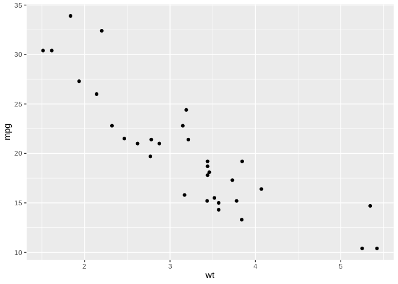

My Analysis
================

``` r
library(ggplot2)
ggplot(mtcars, aes(wt, mpg)) + geom_point()
```

<!-- -->

Then render it with

``` r
# rmarkdown::render("my_vignette.Rmd", output_format = "md_document")
```
